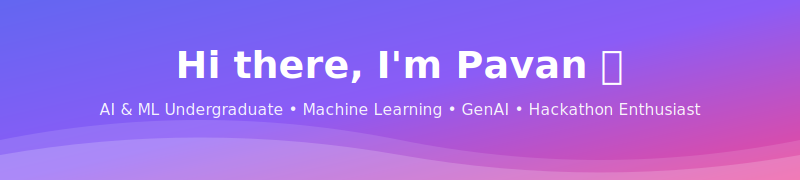

<div align="center">

<!-- Animated wave header -->


<!-- Typing animation -->
<a href="https://github.com/pavankarthikeyaatchyuta-lab">
  
</a>

<br/>

<!-- Social badges -->
<a href="https://www.linkedin.com/in/pavan-karthikeya-atchyuta-3a5040354" target="_blank">
  
</a>
<a href="https://www.instagram.com/_._pavan_karthik_._" target="_blank">
  
</a>
<a href="mailto:pavankarthikeyaatchyuta@gmail.com">
  
</a>

<br/><br/>

<!-- Profile views & followers -->


</div>

<br/>

<!-- Wave divider -->


## 🚀 About Me


```python
class Pavan:
    def __init__(self):
        self.name = "Atchyuta Pavan Karthikeya"
        self.role = "AI & ML Undergraduate"
        self.degree = "B.Tech CSE (AI & ML), 2024–2028"
        self.cgpa = 9.48
        self.rank = "🥇 Rank 1 — CSE (AI & ML) Branch"
        self.identity = "Hackathon Enthusiast 🏆"
        self.focus = [
            "Machine Learning 🧠",
            "Generative AI ✨",
            "Computer Vision 👁️",
            "ML Ranking Systems 📊",
            "Production-deployed AI 🚀"
        ]
        self.currently_exploring = "Edge AI + Multi-Agent Systems"
        self.fun_fact = "I turn hackathon ideas into deployed products"
        self.philosophy = "Learn from every experience — always a continuous learner"

    def say_hi(self):
        return "Thanks for stopping by — let's build something! 🤝"

me = Pavan()
print(me.say_hi())
```

- 🔭 Currently building **AI-powered, production-deployed systems** across GenAI, Computer Vision & ML ranking
- 🏆 Competing in **national-level hackathons**: Flipkart GRiD 8.0, Redrob AI National Hackathon, NHAI Hackathon 7.0
- 🥇 **Top ~0.36%** (95.57/100) — Hack2Skill × Google PromptWars Challenge 3, among 30,787+ participants
- 🥈 Selected for **Round 2 — Meta AI / Hugging Face / PyTorch OpenEnv Hackathon** among 31,000+ teams
- 💡 I learn fast, ship fast, and love turning a vague hackathon prompt into a real, working product
- 🌱 I believe every experience teaches something — I'm a continuous learner, always growing through what I build and what I get wrong
- 📫 Reach me at **pavankarthikeyaatchyuta@gmail.com**

<br clear="right"/>


## 🛠️ Tech Stack

<div align="center">

<a href="https://skillicons.dev">
  
</a>

<br/><br/>

### Languages


### AI / ML


### Frameworks & Tools


### Cloud & Data


### Tools


</div>


## 📌 Featured Projects

<div align="center">

<a href="https://github.com/pavankarthikeyaatchyuta-lab/EcoVerse-AI">
  
</a>
<a href="https://github.com/pavankarthikeyaatchyuta-lab/Redrob-Intelligent-Candidate-Ranker">
  
</a>

<a href="https://github.com/pavankarthikeyaatchyuta-lab/Election-Guide-Assistant">
  
</a>
<a href="https://github.com/pavankarthikeyaatchyuta-lab/NHAI-7.0-FaceGuard">
  
</a>

<a href="https://github.com/pavankarthikeyaatchyuta-lab/AI-Resume-Analyzer-Pro">
  
</a>
<a href="https://github.com/pavankarthikeyaatchyuta-lab/study-bot">
  
</a>

</div>

| Project | What it does |
|---|---|
| 🌍 **[EcoVerse AI](https://github.com/pavankarthikeyaatchyuta-lab/EcoVerse-AI)** | Behavioral climate companion using Gemini — turns daily habits into a 50-year future-city simulation. Built for PromptWars Challenge 3. Live on Cloud Run. |
| 🧠 **[Redrob Candidate Ranker](https://github.com/pavankarthikeyaatchyuta-lab/Redrob-Intelligent-Candidate-Ranker)** | Explainable 7-stage ML ranking pipeline — ranks 100K candidates in ~78s with honeypot/fraud detection, CPU-only. |
| 🗳️ **[Election Guide Assistant](https://github.com/pavankarthikeyaatchyuta-lab/Election-Guide-Assistant)** | Civic-AI assistant with a 7-stage state machine, Hindi TTS, and voice input — deployed on Google Cloud Run. |
| 🛡️ **[FaceGuard Offline](https://github.com/pavankarthikeyaatchyuta-lab/NHAI-7.0-FaceGuard)** | Fully offline facial recognition + liveness detection for field personnel, built with ONNX Runtime Mobile. |
| 📄 **[AI Resume Analyzer Pro](https://github.com/pavankarthikeyaatchyuta-lab/AI-Resume-Analyzer-Pro)** | Recruiter-simulation system scoring resumes via structured Gemini prompts with JSON-mode output. |
| 📚 **[Study Bot](https://github.com/pavankarthikeyaatchyuta-lab/study-bot)** | FastAPI + Gemini-powered learning assistant with MongoDB-backed chat history. |


## 📊 GitHub Stats

<div align="center">


<br/>


</div>


## 🏆 Achievements & Recognition

- 🥇 **Top 0.36%** — Hack2Skill × Google PromptWars Challenge 3 (95.57/100, among 30,787+ participants) — **EcoVerse AI**
- 🥈 **Round 2 Selection** — Meta AI / Hugging Face / PyTorch OpenEnv Hackathon, among 31,000+ teams — Scaler School of Technology
- 🎓 **Shortlisted** — Amazon ML Summer School 2026
- 🏁 **Participant** — Flipkart GRiD 8.0 (AI Engineering Track) · Redrob AI National Hackathon · NHAI Hackathon 7.0
- 📜 **Certified** — Oracle OCI AI Foundations · NPTEL Python for Data Science & IoT · Google AI Essentials · Qualcomm AI Upskilling


<div align="center">

### 💬 Let's Connect & Build Something Together!

<a href="https://www.linkedin.com/in/pavan-karthikeya-atchyuta-3a5040354" target="_blank">
  
</a>
<a href="mailto:pavankarthikeyaatchyuta@gmail.com">
  
</a>

<br/><br/>


<br/>

<i>⭐️ From <a href="https://github.com/pavankarthikeyaatchyuta-lab">pavankarthikeyaatchyuta-lab</a> — Thanks for visiting!</i>

</div>


